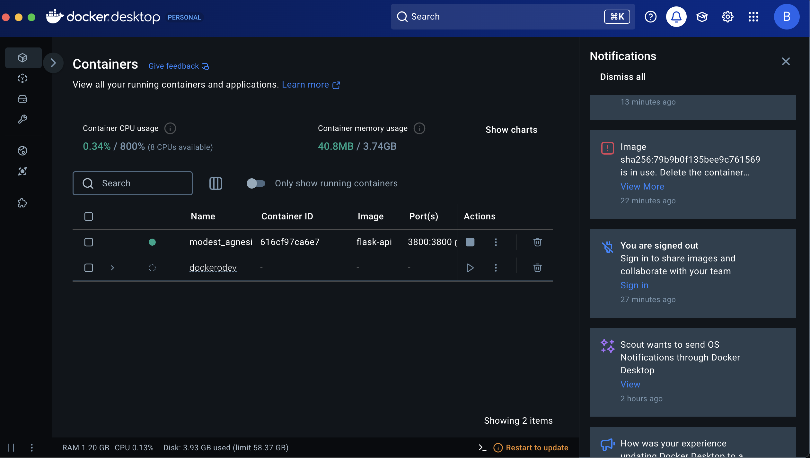

# dockerOdev

# Flask API Projesi

Bu proje, Flask kullanarak temel matematiksel işlemleri gerçekleştiren bir API sunar. Docker ve Docker Compose desteği ile kolayca çalıştırılabilir. 

---

## Proje Özellikleri

- **Toplama (`/sum?a=5&b=3`)**: GET isteği ile iki sayıyı toplar.
- **Çıkarma (`/subtract`)**: GET isteği ile iki sayıyı çıkarır.
- **Çarpma (`/multiply`)**: POST isteği ile iki sayıyı çarpar.
- **Bölme (`/divide`)**: POST isteği ile iki sayıyı böler.
- **Özel Hata Mesajları**: 404 ve 500 gibi hatalar için özelleştirilmiş yanıtlar içerir.

---

## Gereksinimler

- Docker
- Docker Compose
- Python 3.9 veya üstü (isteğe bağlı)

---

## 1. Dockerfile ile Docker İmajı Oluşturma

### Adımlar:

1. **Proje klasöründe bir `Dockerfile` oluşturun** ve aşağıdaki içeriği ekleyin:

   ```dockerfile
   # Python tabanlı bir imaj 
   FROM python:3.9-slim

   # Çalışma dizinini oluştur ve ayarla
   WORKDIR /app

   # Gereken dosyaları kopyala
   COPY requirements.txt requirements.txt
   COPY app.py app.py

   # Flask bağımlılıklarını yükle
   RUN pip install --no-cache-dir -r requirements.txt

   # Flask uygulamasını çalıştır
   CMD ["python", "app.py"]
   ```

2. **`requirements.txt` oluşturun**  
   Projenin bağımlılıklarını içeren bu dosyanın içeriği şu şekilde olmalıdır:

   ```
   flask
   ```

3. **Docker imajını oluşturun**  
   Terminalde aşağıdaki komutu çalıştırarak Docker imajınızı oluşturun:

   ```bash
   docker build -t flask-app .
   ```

---

## 2. Docker Container ile Uygulamayı Çalıştırma

### Adımlar:

1. **Container'ı başlatın:**  
   Terminalde aşağıdaki komutu çalıştırarak container'ı başlatabilirsiniz:

   ```bash
   docker run -d -p 3800:3800 flask-app
   ```

   - `-d`: Container'ı arka planda çalıştırır.
   - `-p 3838:3838`: Host ve container portlarını eşleştirir.

2. **Uygulamanın çalıştığını kontrol edin:**  
   Tarayıcınızda veya Postman ile şu URL'leri ziyaret ederek kontrol edebilirsiniz:

   - `http://localhost:3800/sum?a=5&b=3`
   - `http://localhost:3800/multiply`

   Çalışıyorsa JSON formatında bir yanıt alırsınız.

---

## 3. Docker Compose ile Uygulamayı Çalıştırma

### Adımlar:

1. **Proje klasöründe bir `docker-compose.yaml` dosyası oluşturun** ve aşağıdaki içeriği ekleyin:

   ```yaml
   version: '3.8'
   services:
     flask-app:
       build:
         context: .
         dockerfile: Dockerfile
       ports:
         - "3800:3800"
       volumes:
         - .:/app
       command: ["python", "app.py"]
   ```

2. **Docker Compose kullanarak container'ı başlatın:**  
   Aşağıdaki komutu terminalde çalıştırın:

   ```bash
   docker compose up -d
   ```

3. **Çalıştığını kontrol edin:**  
   Tarayıcı veya Postman üzerinden şu URL'lere giderek uygulamanın çalıştığını doğrulayabilirsiniz:

   - `http://localhost:3800/sum?a=5&b=3`
   - `http://localhost:3800/multiply`


## Proje Yapısı

```plaintext
.
├── app.py               # Flask API uygulaması
├── requirements.txt     # Python bağımlılıkları
├── Dockerfile           # Docker yapılandırma dosyası
├── docker-compose.yaml  # Docker Compose yapılandırması
└── README.md            # Bu dosya
```

---

## Proje Sonucu
Proje çalıştığında localhost:3800 da çalışacaktır.




